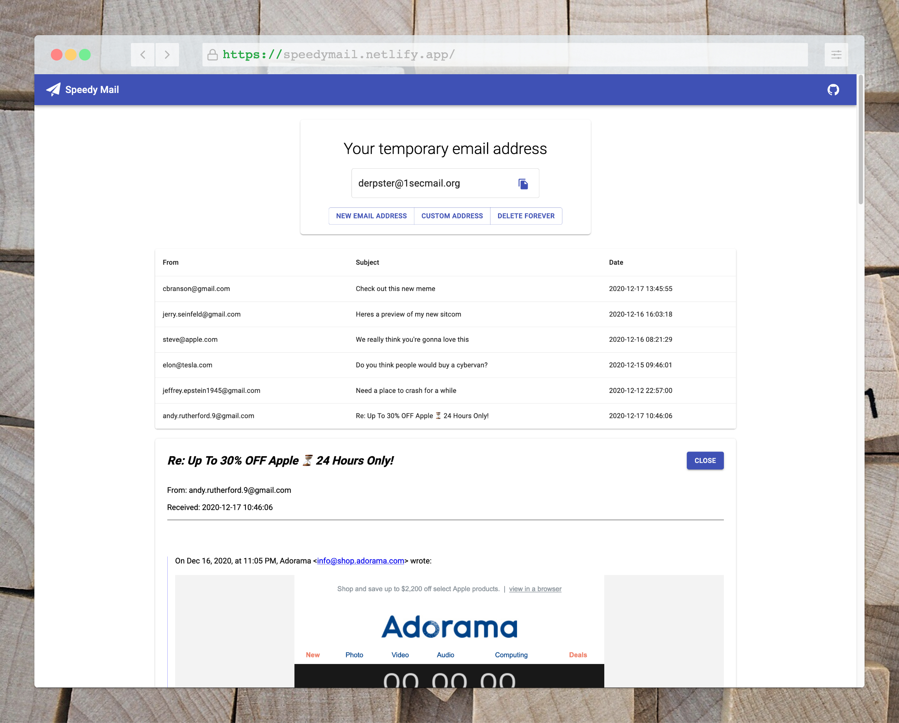

# Speedy Mail

Create a temporary email address is ready to receive messages and attached files.



## Features

- Create a custom temporary email address, or have one randomly generated for you.
- Text emails will be displayed as text. HTML emails will be parsed and displayed as HTML.
- Included email attachments can be viewed and downloaded.

## Setup

To run this application, you'll need [Git](https://git-scm.com/) and [Node.js](https://nodejs.org/) (which comes with [npm](https://www.npmjs.com/)) installed on your computer. From your command line:

```sh
# Clone this repository
$ git clone

# Enter the repo directory
$ cd

# Install dependencies
$ npm install

# Start the app
$ npm start

```

## Tech

- [ReactJS](https://reactjs.org/) - A JavaScript library for building user interfaces
- [Typescript](https://www.typescriptlang.org/) - TypeScript extends JavaScript by adding types
- [React-Query](https://github.com/tannerlinsley/react-query) - Hooks for fetching, caching and updating asynchronous data in React
- [Material-UI](https://material-ui.com/) - Popular React UI framework
- [styled components](https://styled-components.com/) - for styled components
- [1secMail API](https://www.1secmail.com/api)

## Demo

https://speedymail.netlify.app/

## License

MIT
